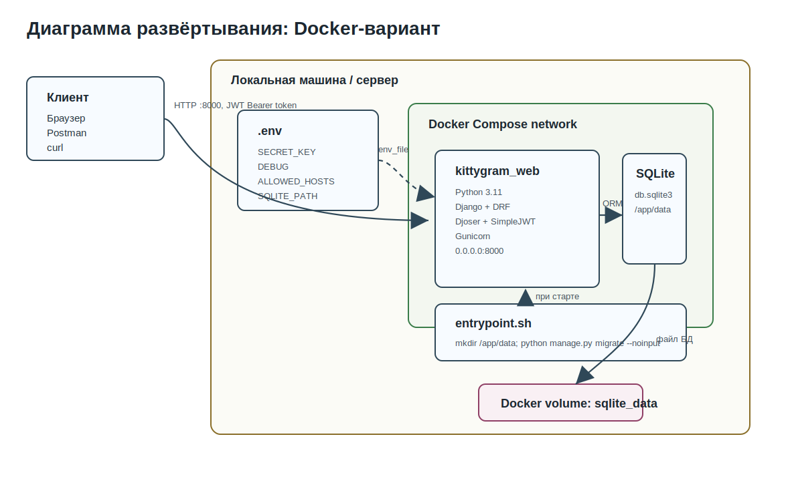
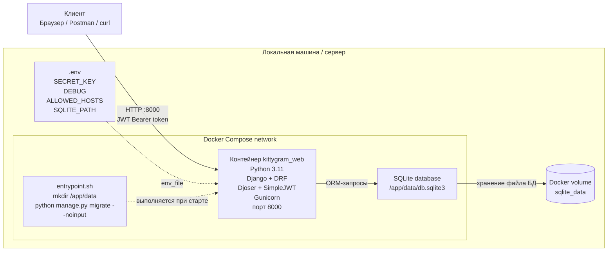

# Диаграмма развёртывания: Docker-вариант

Диаграмма отражает локальную эксплуатацию проекта Kittygram через Docker Compose.
Этот вариант соответствует файлам `Dockerfile`, `docker-compose.yml`,
`.env.example` и `entrypoint.sh`.

## Mermaid-исходник

## Пояснение к развёртыванию

| Компонент | Назначение |
|---|---|
| Клиент | Браузер, Postman или curl отправляет HTTP-запросы к API на `http://127.0.0.1:8000/`. |
| Docker Compose | Запускает сервис `web`, пробрасывает порт `8000:8000` и подключает volume `sqlite_data`. |
| Контейнер `kittygram_web` | Содержит приложение Django REST Framework и запускает его через Gunicorn. |
| `entrypoint.sh` | При старте контейнера создает директорию `/app/data` и применяет миграции командой `python manage.py migrate --noinput`. |
| `.env` | Передает настройки приложения: секретный ключ, режим отладки, разрешенные хосты и путь к SQLite. |
| SQLite volume | Хранит файл базы данных `/app/data/db.sqlite3` между перезапусками контейнера. |

## Последовательность запуска

1. Пользователь создает `.env` на основе `.env.example`.
2. Команда `docker compose up --build` собирает образ и запускает контейнер.
3. `entrypoint.sh` применяет миграции.
4. Gunicorn поднимает Django-приложение на `0.0.0.0:8000`.
5. Клиент отправляет запросы к API через `http://127.0.0.1:8000/`.
