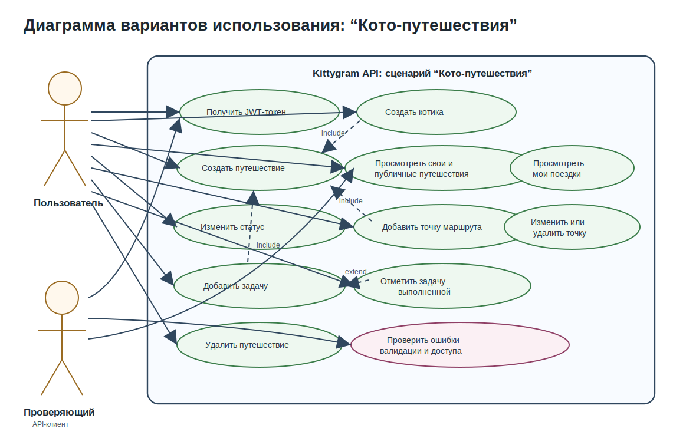
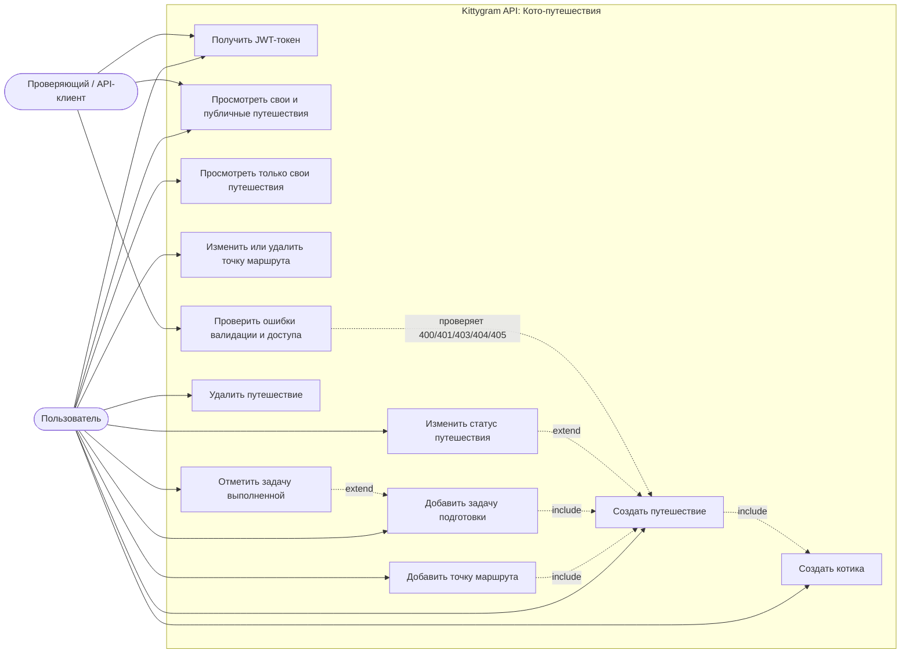

# Диаграмма вариантов использования: “Кото-путешествия”

Диаграмма показывает пользовательские действия, которые поддерживает серверная
часть Kittygram в сценарии планирования путешествий с котиком.

## Mermaid-исходник

## Расшифровка основных вариантов использования

| Вариант использования | Описание |
|---|---|
| Получить JWT-токен | Пользователь проходит аутентификацию через Djoser/SimpleJWT и получает токен для защищенных API-запросов. |
| Создать котика | Пользователь создает карточку котика, который затем может быть связан с путешествием. |
| Создать путешествие | Пользователь создает поездку только для своего котика, указывая направление, даты, транспорт, статус и публичность. |
| Просмотреть свои и публичные путешествия | Пользователь получает список своих путешествий и путешествий других пользователей, если они отмечены как публичные. |
| Изменить статус путешествия | Владелец путешествия меняет состояние поездки: `planned`, `in_progress`, `completed` или `cancelled`. |
| Добавить точку маршрута | Владелец путешествия добавляет город, страну, адрес и даты пребывания в рамках дат поездки. |
| Добавить задачу подготовки | Владелец путешествия создает пункт чек-листа, например получение ветеринарной справки. |
| Отметить задачу выполненной | Владелец меняет поле `is_done`, фиксируя выполнение подготовительной задачи. |
| Проверить ошибки валидации и доступа | Проверяющий повторяет отрицательные сценарии: некорректные даты, повторный номер точки, запрос без токена, несуществующий ресурс, неподдерживаемый метод. |
